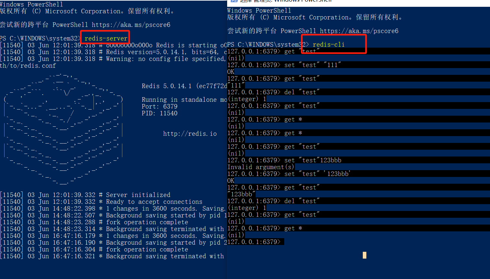

# 博客

## Navicat 创建数据库/表的基础操作

[参考](https://blog.csdn.net/m0_64090099/article/details/134918312)

## mysql

数据库三要素

1. 主键
2. 创建时间
3. 更新时间

## Express 应用程序生成器

[参考](https://www.expressjs.com.cn/starter/generator.html)

## cross-env

cross-env 通过其跨平台的兼容性、简化环境变量的设置、提高开发效率、增强应用程序的可配置性和安全性等优势，成为了跨平台开发中不可或缺的工具。

[参考 1](https://www.npmjs.com/package/cross-env)

[参考 2](https://blog.csdn.net/qq_44776454/article/details/134154279)

## nodemon

NodeJS 保存自动更新

[参考](https://www.npmjs.com/package/nodemon)

ES6 class

MVC 采用结构清晰的模式 方便后期维护

res . end

res.json()

`sh` js

---

日志

故障排查
性能分析
用户行为分析
安全审计

morgan

file-stream-rotator ???

process.env.NODE_ENV 项目启动时指定

"file-stream-rotator": "^1.0.0",

日志分割

---

validator

form-data x-www-form-urlencoded raw

区别

Postman 使用教程

https://www.jianshu.com/p/cbc34df2f008

bnmvp

zxcv123

待整理~

---

mysql 不能正常使用

mysqld --console 查看 mysql 日志

taskkill -pid 20504 -f #强制关进程

https://blog.csdn.net/qq_31680395/article/details/80441267

Do you already have another mysqld server running on port: 3306 ?

mysqld --console --skip-grant-tables --shared-memory”

https://baijiahao.baidu.com/s?id=1761959559424162329&wfr=spider&for=pc

win10 powershell:cd Program Files (x86) 或报错 Set-Location : 找不到接受实际参数“Files”的位置形式参数

https://blog.csdn.net/weixin_39773337/article/details/116398870

redis-server 启动 redis 服务器

新建命令行 redis-cli

打开它的客户端

