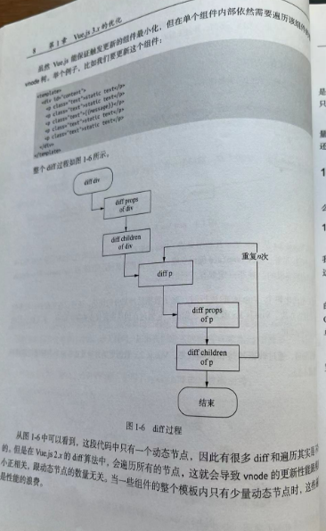

# Vue.js 3.x 的优化

### 1.1.2 TypeScript （拥抱）

## 1.2 性能优化

### 1.2.1 源码体积优化

未被导入的 square 模块被标记了，然后压缩阶段会利用 uglifg-js 和 terser 等压缩工具真正的删除这段没有用到的代码。

利用 tree-shaking 技术，它们对应的代码就不会被打包，这样也就间接达到了减小 Vue.js 代码体积的目的。

### 1.2.2 数据劫持优化


### 1.2.3 编译优化


new Vue -> init -> $mount -> compile -> render -> vnode -> patch -> DOM



vue2 diff 算法 仍然需要遍历该组件的整个 vnode 树

改进后的 diff 算法

理想状态是只需要 diff 这个绑定 message 动态节点 p 标签即可

## 1.3 语法 API 优化

Vue 3.x Composition API

Vue 2.x Options API 的设计按照 methods，computed，data，props 这些不同的选项分类

RFC Request For Comments 旨在为新功能进入框架提供一个一致且受控的路径。

# Vue.js 3.x 源码总览

## 2.1 目录结构


- compiler-core

把模版字符串转化为渲染函数。 在 AST 的节点转化过程中会执行很多转化插件，compiler-core 则包含所有与平台无关的转换插件。

- compiler-dom

它是在 compiler-core 的基础上进行的封装。compiler-dom 包含了专门针对浏览器的转化插件。

- compiler-ssr

在服务端编译时，会使用 compiler-ssr 提供的编译器，它也是在 compiler-core 的基础上进行的封装，也依赖 compiler-dom 提供的一部分辅助转换函数。 compiler-ssr 包含了专门针对服务端渲染的转换插件。

- compiler-sfc

我们通常会用 .vue 编写单个文件组件但是 .vue 文件类型是不能被浏览器直接解析的，需要编译。

为了处理.vue 文件，我们会借助如 webpack 的 vue-loader 这样的处理器。它会先解析 .vue 文件，把 tempalte，script，style 部分抽离出来，然后各个模块运行各自的解析器，单独解析。

.vue 文件的接卸，以及 template,script,style 的解析的相关代码都是由 compiler-sfc 模块实现的。

- runtime-core

runtime-core 包含了与平台无关的运行时核心实现，包括了虚拟 DOM 的渲染器，组件实现和一些全局的 JavaScript API。可以基于 runtime-core 创建针对特定平台的高阶运行时。

- runtime-dom

它就是基于 runtime-core 创建的以浏览器为目标的运行时，包括对原生的 DOM API，属性，样式，事件等的管理。

- runtime-test

它用于测试 runtime-core 的轻量级运行时。

- reactivity

数据驱动是 Vue.js 的核心概念之一，响应式系统是实现数据驱动的前提。

- template-explorer

它是用于调试模版编译输出的工具。

- sfc-playground

和 template-explorer 类似， sfc-playground 是用于调试 SFC 单文件组件编译输出的工具。

- shared

它包含多个包共享的内部实用工具库。

- server-renderer

它包含了服务端渲染的核心实现。

- vue

vue 是面向用户的完整构建，包含运行时版本和带编译器的版本。

- vue-compat

它是 Vue.js 3.x 的一个构建版本，提供可以配置的 Vue.js 2.x 兼容行为。

## 3.1 什么是 vnode

vnode 本质上是用来描述 DOM 的 JavaScript 对象

### 3.1.1 普通元素 vnode

```html
<button class="btn" style="width:100px;height:50px"></button>
```

可以用 vnode 这样表示 <button> 标签

```js
const vnode = {
  type: "button",
  props: {
    class: "btn",
    style: {
      width: "100px",
      height: "50px",
    },
  },
};
```

vnode 的性能一定比手动操作原生 DOM 要好吗？其实不一定，分情况

比如，对于一个 1000 行 x 10 列的 Table 组件，组件渲染生成 vnode 的过程会遍历 1000 行 x 10 次去创建内部 cell vnode,整体耗时就会比较长。再加上挂载 vnode 生成 DOM 的过程也会有一定的耗时，所以当我们更新组件的时候，用户就会感觉到明显卡顿。

虽然 diff 算法在减少操作 DOM 方面足够优秀，但最终还是免不了操作 DOM ，因此性能并不是 vnode 的优势所在。

源码目录

C:\zml\zml2024learn\vue3_yuanma\core

待完善
