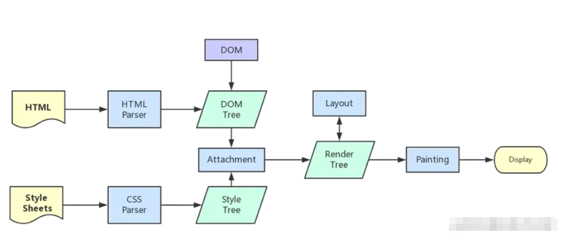
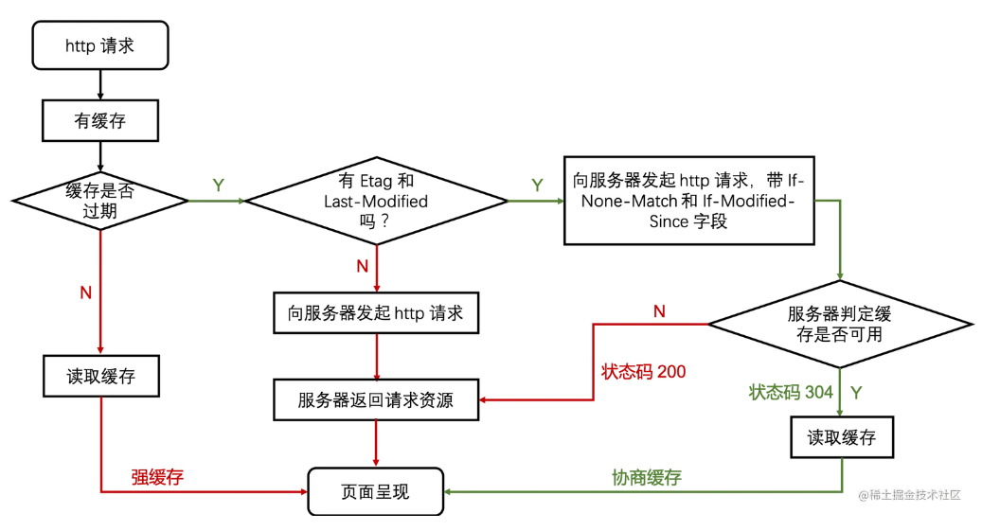

# 优化方向

## 从浏览器地址栏输入 url 到请求返回发生了什么

1. 输入 URL 后解析出协议

- 强制缓存
- 协商缓存

2. DNS 域名解析

3. TCP 连接

总是要问：问什么需要三次握手？两次不行吗？其实就是 TCP 自身特点 <strong>可靠传输</strong> 决定的。
客户端和服务端要进行可靠传输，那就需要<strong>确认双方的接收和发送能力</strong>。
第一次握手可以确认客户端的<strong>发送能力</strong>，第二次握手是确认了服务端的<strong>接收能力和发送能力</strong>。所以第三次握手才能确认客户端的<strong>接收能力</strong>。不然容易出现丢包现象。

4. HTTP 请求

5. 服务器处理请求并返回 HTTP 报文

6. 浏览器渲染页面
   

   

7. 断开 TCP 连接

# 第 3 章 图像优化

## 3.2 图像优化

### 3.2.1 JPEG

压缩模式

基线式 JPEG 加载顺序是自上而下的。

渐进式 首先展示一个低质量模糊的图像，随着扫描到的信息不断增多，每次扫描过后所展示的图像清晰度也会不断提升。

应该能注意到渐进式 JPEG 已经在渐渐地取代 基线 JPEG 了。

创建渐进式 JPEG

待完善~

# 第 5 章 书写高性能代码

## 5.1 数据存取

### 5.1.2 作用域和作用域链

理解作用域链对标识符的解析过程对我们编写高效的 JavaScript 非常有用，因为查找变量的个数会直接影响解析过程的长短。变量位于作用域链中的位置越深，被引擎访问到所需要的时间就越长，所以我们应当留心对作用域链的管理。

### 5.1.3 对局部变量的使用

记住一个建议：如果一个非局部变量在函数中的使用次数不止一次，那么最好使用局部变量进行存储。举个例子，

```js
function process(){
  const target = document.getElementById('target');
  const imgs = target.getElementByClassName('img');

  for(let i = 0; i < imgs.length; i++){
    const img = imgs[i];
    // 省略相关处理流程
    ...
    target.appendChild(img);
  }
}
```

值得注意的是，document 属于全局作用对象，位于作用域链的最深处，标识符在解析过程中会被最后解析到。由于它在函数中使用不止一次，所以可以考虑将其声明为一个局部变量，以提升其在作用域链中的查找顺序。

### 5.2.1 匹配频率高的更快执行

```js
if (value === 8) {
  // 匹配到 8 的概率最高
} else if (value === 7) {
  // 匹配到 7 的概率仅次于8
} else if (value === 6) {
  // 匹配到 6 的概率低
} else {
  // 匹配到其他值的概率最低
}
```

策略模式

```js
// 计算奖金的方法
// bad
function calculateBonus(salary, level) {
  if (level === "S") {
    return salary * 4;
  } else if (level === "A") {
    return salary * 3;
  } else if (level === "B") {
    return salary * 2;
  }
}

// 奖金发放策略
// good
const strategies = {
  S: (salary) => salary * 4,
  A: (salary) => salary * 3,
  B: (salary) => salary * 2,
};

function calculateBonus(level, salary) {
  return strategies[level](salary);
}
```

### 5.4.2 异步队列

让每一个异步任务仅处理数组中的一个数据集，对于较大规模的数组可以预先规定依次异步任务的处理数量，然后拆分数据集，依次加入异步队列进行处理。

例子，分时函数

# 第 6 章 构建优化

## 6.1 压缩与合并

### 6.1.1 压缩 HTML

```js
const fs = require("fs");
const minify = require("html-minifier").minify;

fs.readFile("./test.html", "utf8", (err, data) => {
  if (err) {
    throw err;
  }
  fs.writeFile(
    "./test.min.html",
    minify(data, {
      collapseWhitespace: true, // 去掉空格
      minifyCSS: true, // 压缩css
      minifyJS: true, // 压缩js
      removeComments: true, // 去掉注释
    }),
    (err) => {
      if (err) {
        throw err;
      }
    }
  );
});
```

## 6.4 webpack 的优化性能

### 6.4.1 尽量与时俱进

因为新的工具 比如 webpack 每个版本更新时，其内部肯定进行相应的优化。

因此在项目中尽可能使用最新的，稳定版本的 webpack nodejs npm 或者 yarn 能有效地提升打包构建的效率

### 6.4.2 减少 Loader 执行

在尽可能少的模块上执行 Loader。

比如

```js
const path = require('path');
module.exports = {
  entry: {
    main: './src/index.js',
  },
  module: {
    rules: [ // 对于 JavaScript 文件打包规则
    test: /\.js$/,
    // 针对除了 node_modules 文件夹路径之外的 JavaScript
    exclude: /node_modules/,
    use:[{loader: 'babel-loader'}]
    ]
  },
  ...
  output: { // 构建输出位置
    filename: '[name].js',
    path: path.resolve(__dirname, 'dist'),
  }
}
```

### 6.4.3

如果在开发环境，由于不用考虑代码对用户的加载速率，并且压缩后可能会降低代码的可读性，增加开发成本，所以在开发环境下不用引入代码压缩插件。

### 6.4.4 合理配置 resolve 参数

配置 resolve 参数可以为我们在编写代码引入模块时提供不少便利，比如在使用 extensions 省略引入 javaScript 文件的后缀名，使用 alias 减少书写所引入模块的多目录层级。

```js
modules.exports = {
  resolve: {
    extensions: [".js", ".jsx", ".json"],
    alias: {
      components: path.resolve(__dirname, "src/components"),
    },
  },
};
```

### 6.4.7 压缩打包结果的体积

```js
const UglifyJsPlugin = require("uglifyjs-webpack-plugin");
module.exports = {
  plugins: [
    {
      cache: true, // 开启缓存
      parallel: true, // 允许并发执行
      compress: {
        drop_console: true, // 删除console
        reduce_vars: true, // 删除未使用的变量
      },
      output: {
        comments: false, // 删除注释
        beautify: false, // 删除多余空格，代码尽可能紧凑
      },
    },
  ],
};
```

代码拆分 按需加载

# 第 7 章 渲染优化

## 7.2 JavaScript 执行优化

### 7.2.1 实现动画效果

推荐使用 requestAnimationFrame 代替 JavaScript 的 setInterval 所产生动画。

### 7.2.2 恰当使用 Web Worker

### 7.2.3 事件节流和事件防抖

## 7.3 计算样式优化

### 7.3.1 减少要计算样式的元素数量

CSS 引擎在查找样式表时，每条规则的匹配顺序是从右向左的

比如

```css
.product-list li {
}
```

CSS 引擎需要首先遍历页面上的所有 li 标签元素，然后确认每个 li 标签有包含类名为 product-list 的父元素才是目标元素，所以为了提高页面的渲染性能，计算样式阶段应当尽量减少参与样式计算的元素数量。

建议 1. product-list 下的 li 标签规则可以直接定义为 product-list_li

建议 2. 通常在编写 CSS 样式前都会有使用通配符去清除默认样式的习惯

```css
* {
  margin: 0;
  padding: 0;
  border: 0;
  font-size: 16px;
  font: inherit;
  vertical-align: baseline;
}
```

规模较小的 Demo 中,几乎看不出有任何的性能差异。但对实际的工程项目来说，使用通配符就意味着在计算样式时，浏览器需要遍历页面中的每一个元素，性能开销很大，应当避免使用。

### 7.3.2 降低选择器的复杂性

```css
/* bad */
.content #my-content
/* good */
#my-content;
```

### 7.3.3 使用 BEM 规范

Block Element Modifier

中划线(-):表示某个块或子元素的多个单词之间的连接符。
单划线(\_):作为描述一个块或其子元素的一种状态。
双线划线(\_\_):作为连接块与块的子元素

例子

```css
/* bad */
.mylist {
}
.mylist .item {
}
/* good */
.mylist {
}
.mylist__item {
}
```

```css
.mylist__item_big {
}
.mylist__item_normal {
}
.mylist__item_small {
}

.mylist__item_size-10 {
}
```

BEM 样式编码规范建议所有元素都被单一的类选择器修饰，从 CSS 代码角度来说这样不但更加清晰，而且由于样式查找得到简化，渲染阶段的样式计算性能也会得到提升。

## 7.4 页面布局与重绘的优化

### 7.4.2 避免样式的频繁改动

1. 样式改变，统一更改类名

<!-- 反例bad -->

```js
const div = document.getElementById("my-div");
div.style.height = "100px";
div.style.width = "100px";
div.style.backgroundColor = "red";
```

可以 CSS 类名预先定义

<!-- 正例 good -->

```css
.my-div {
  height: 100px;
  width: 100px;
  background-color: red;
}
```

然后统一指定元素添加类

```js
const div = document.getElementById("my-div");
div.clssList.add("my-div");
```

2. 缓存对敏感属性值的计算

```js
const list = document.getElementById("list");
for (let i = 0; i < 10; i++) {
  list.style.top = `${list.offsetTop + 10}px`;
  list.style.left = `${list.offsetLeft + 10}px`;
}
```

```js
const list = document.getElementById("list");
// 将敏感属性缓存起来
let offsetTop = list.offsetTop,
  offsetLeft = list.offsetLeft;

for (let i = 0; i < 10; i++) {
  offsetTop += 10;
  offsetLeft += 10;
}

// 计算完成后统一赋值进行触发
list.style.left = `${offsetLeft}px`;
list.style.top = `${offsetTop}px`;
```

# 第 8 章 服务端渲染

# 第 10 章 缓存技术



- 强制缓存

expries 仍然存在，其目的是为了保持向下兼容。为了弥补 expries 的缺陷，HTTP 1.1 规范新增 cache-control 。其值有 max-age 设置缓存时间，（cache-control: max-age=31536000）;有
no-store 不缓存;有 no-cache 开启协商缓存。

- 协商缓存

首次请求 last-modified（last-modified: Mon, 01 Jan 2018 00:00:00 GMT）。Etag 为了弥补，假设资源修改发生在毫秒级， HTTP 1.1 规范新增（类似文件指纹）。

再次请求 if-modified-since 值 是 last-modified 的值；if-none-match 值 是 Etag 的值。 验证缓存的新鲜度 判断是返回时 304 还是 200。

严格按照规范进行开发，设计，实施。
