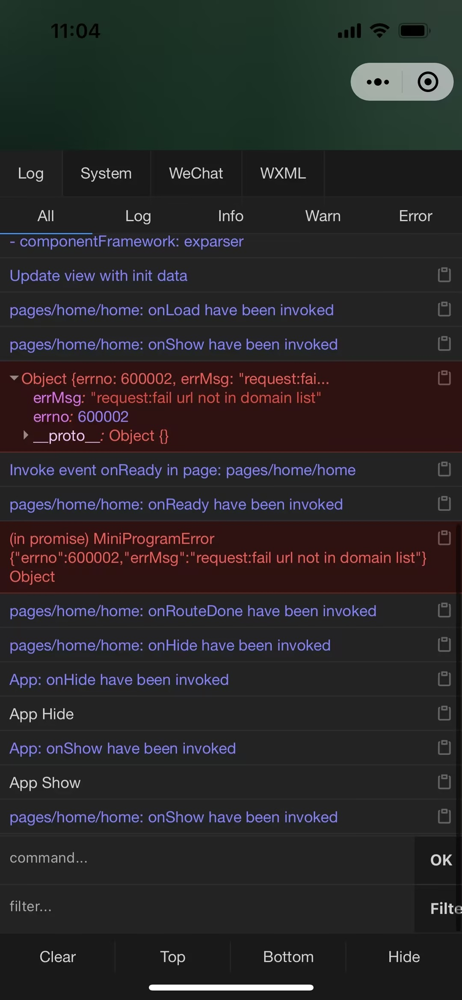

# bug

## 微信小程序 bug

errMsg: "request:fail url not in domain list" errno: 600002

参考

- 对于 https 域名，可以配置端口，如 https://myserver.com:8080，但是配置后只能向 https://myserver.com:8080 发起请求。如果向 https://myserver.com、https://myserver.com:9091 等 URL 请求则会失败。如果不配置端口。如 https://myserver.com，那么请求的 URL 中也不能包含端口，甚至是默认的 443 端口也不可以。如果向 https://myserver.com:443 请求则会失败。

https://developers.weixin.qq.com/miniprogram/dev/framework/ability/network.html
