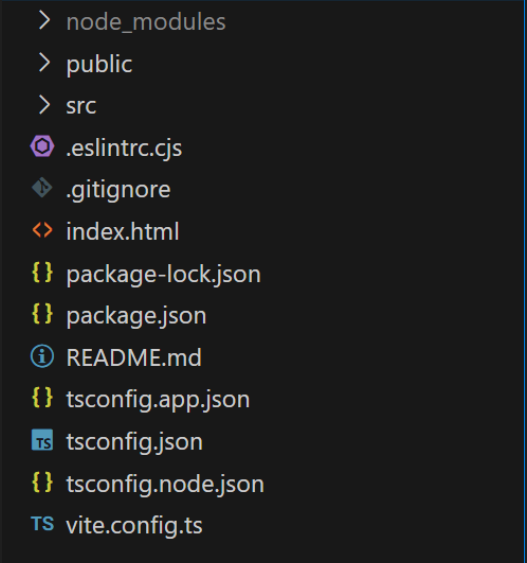

# vite 创建 react + TS 项目，配置路径别名的记录

## 配置路径别名

1. 修改 vite 配置

vite.config.ts

```ts
import { defineConfig } from "vite";
import react from "@vitejs/plugin-react";
import path from "path";

// https://vitejs.dev/config/
export default defineConfig({
  plugins: [react()],
  resolve: {
    alias: {
      "@": path.resolve(__dirname, "./src"),
    },
  },
});
```

2. 安装 node 类型包 （防止 path.resolve 报错）

```bash
npm i @types/node -D
```

3. 修改 tsconfig.json 文件 (如果不生效，则配置在 tsconfig.app.json 内)



截至 2024-07-24 已近变为 3 个.json 文件

tsconfig.app.json，tsconfig.json，tsconfig.node.json

```json
{
  "compilerOptions": {
    // ...
  {
    "baseUrl": ".",
    "paths": {
      "@/*": ["src/*"]
    }
  }
}
```
