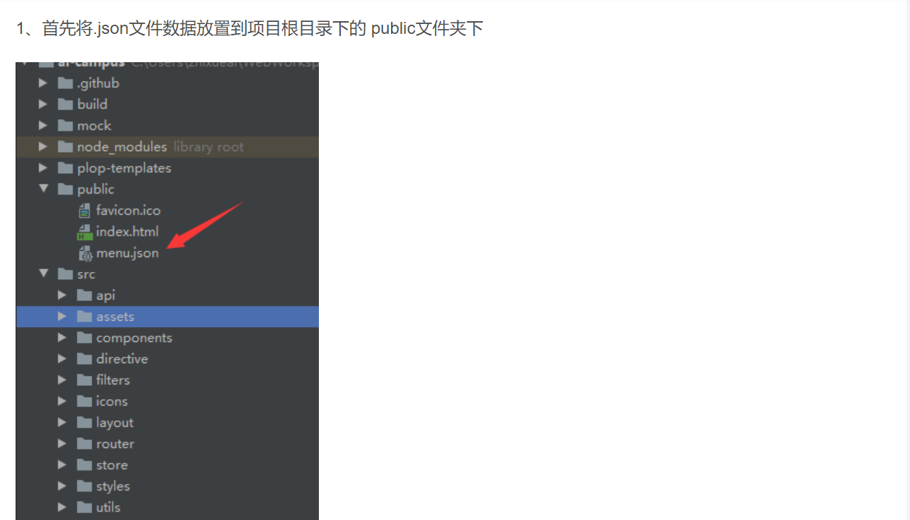
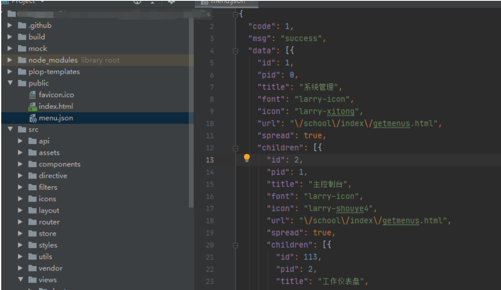
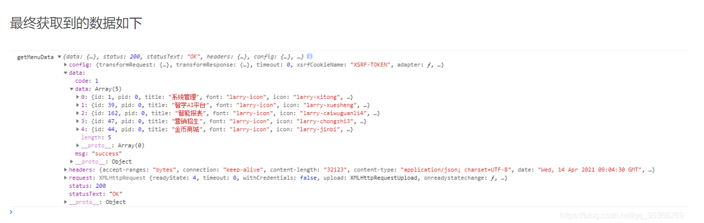

# vite 脚手架搭建

场景应用：避免写一大堆的 import，比如关于 Vue 和 Vue Router 的

npm i -D unplugin-auto-import

---


# vue3+ts+vite 项目使用 unplugin-auto-import (自动导入)

```code
npm i -D unplugin-auto-import
```

vite.config.ts

```ts
import AutoImport from "unplugin-auto-import/vite";

export default defineConfig({
  plugins: [
    // ... other
    AutoImport({
      imports: ["vue", "vue-router", "pinia"], // 自动引入的三方库
      dts: "src/types/auto-import.d.ts", // 全局自动引入文件存放路径；不配置保存在根目录下；配置为false时将不会生成 auto-imports.d.ts 文件（不影响效果）
    }),
  ],
});
```

- ps: 我配置了后并没有效果，还是会报错如找不到名称“computed”。ts-plugin(2304)，如下


解决方法：tsconfig.json 里面配置如下：

```json
"include": [
    "src/**/*.js",
    "src/**/*.ts",
    "src/**/*.tsx",
    "src/**/*.jsx",
    "src/**/*.vue",
    "./types/auto-imports.d.ts" // 和 AutoImport dts保持一致 引入即可
  ],

```

# VSCode 中，TS 提示 ”无法找到 \*.vue 声明文件“ 的解决方案

1. env.d.ts (有则追加，无则新建。内容如下)

```ts
declare module "*.vue" {
  import { defineComponent } from "vue";
  const Component: ReturnType<typeof defineComponent>;
  export default Component;
}
```

2. 在 ”tsconfig.json“ 中，将第二步中创建的文件 "env.d.ts"（或者你自己新建的其他名称的 .d.ts 文件）添加到 include 中

# vite+vue3+ts 中的 vue-router index 配置

index.ts

```ts
import { createRouter, createWebHashHistory, RouteRecordRaw } from "vue-router";
import { routes } from "./routes";
// 对RouteRecordRaw类型进行扩展
export type AddRouteRecordRaw = RouteRecordRaw & {
  hidden?: boolean;
};

export const router = createRouter({
  history: createWebHashHistory(),
  routes: [...routes] as AddRouteRecordRaw[],
});
```

# vite+vue3+ts 中的 vue-router routes 配置

routes.ts

```ts
import HomeView from "@/components/HomeView.vue";

import Layout from "../views/layout/layout.vue";

import Home from "../views/layout/home/home.vue";
import Classify from "../views/layout/classify/classify.vue";
import Shoppingcar from "../views/layout/shoppingcar/shopping.vue";
import My from "../views/layout/my/my.vue";

import Login from "../views/login/login.vue";
import Search from "../views/search/search.vue";
const routes = [
  { path: "/", component: HomeView },
  {
    path: "/layout",
    component: Layout,
    redirect: "/layout/home",
    children: [
      { path: "home", component: Home },
      { path: "classify", component: Classify },
      { path: "shoppingcar", component: Shoppingcar },
      { path: "my", component: My },
    ],
  },
  { path: "/login", component: Login },
  { path: "/search", component: Search },
  // {
  //   path: "/404",
  //   name: "404page",
  //   component: NotFoundComponent,
  // },
  // { path: "/:pathMatch(.*)", redirect: "/404", hidden: true },
];
export default routes;
```

# vite+vue3+ts 中的 vue-router 页面配置

```vue
<template>
  <div>
    <!-- <router-link to="/">首页</router-link> | 
    <router-link to="/about">关于</router-link> -->

    <router-view></router-view>
  </div>
</template>
```

# package.json "exports". The 'vuex' library may need to update its package.js

tsconfig.json

```json
"compilerOptions": {
  ...
    "paths": {
      "@/*": ["src/*"],
      "vuex": ["./node_modules/vuex/types"] // 关键代码
    }
  },
```

# Vue 项目中获取本地的 json 文件数据





2. 然后到需要使用的地方通过 axios 获取本地数据，代码如下：

```js
  getMenuData() {
      axios.get('/menu.json')
        .then(result => {
          console.log('getMenuData', result)
        })
        .catch(error => {
          console.log(error)
        })
    }
```


