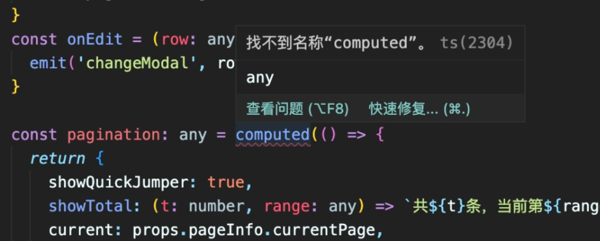

# vite 脚手架搭建

场景应用：避免写一大堆的 import，比如关于 Vue 和 Vue Router 的

npm i -D unplugin-auto-import

---


# vue3+ts+vite 项目使用 unplugin-auto-import (自动导入)

```code
npm i -D unplugin-auto-import
```

vite.config.ts

```ts
import AutoImport from "unplugin-auto-import/vite";

export default defineConfig({
  plugins: [
    // ... other
    AutoImport({
      imports: ["vue", "vue-router", "pinia"], // 自动引入的三方库
      dts: "src/types/auto-import.d.ts", // 全局自动引入文件存放路径；不配置保存在根目录下；配置为false时将不会生成 auto-imports.d.ts 文件（不影响效果）
    }),
  ],
});
```

- ps: 我配置了后并没有效果，还是会报错如找不到名称“computed”。ts-plugin(2304)，如下



解决方法：tsconfig.json 里面配置如下：

```json
"include": [
    "src/**/*.js",
    "src/**/*.ts",
    "src/**/*.tsx",
    "src/**/*.jsx",
    "src/**/*.vue",
    "./types/auto-imports.d.ts" // 和 AutoImport dts保持一致 引入即可
  ],

```

# VSCode 中，TS 提示 ”无法找到 \*.vue 声明文件“ 的解决方案

1. env.d.ts (有则追加，无则新建。内容如下)

```ts
declare module "*.vue" {
  import { defineComponent } from "vue";
  const Component: ReturnType<typeof defineComponent>;
  export default Component;
}
```

2. 在 ”tsconfig.json“ 中，将第二步中创建的文件 "env.d.ts"（或者你自己新建的其他名称的 .d.ts 文件）添加到 include 中

# vite+vue3+ts 中的 vue-router 基本配置

```ts
import { createRouter, createWebHashHistory, RouteRecordRaw } from "vue-router";
import { routes } from "./routes";
// 对RouteRecordRaw类型进行扩展
export type AddRouteRecordRaw = RouteRecordRaw & {
  hidden?: boolean;
};

export const router = createRouter({
  history: createWebHashHistory(),
  routes: [...routes] as AddRouteRecordRaw[],
});
```

# package.json "exports". The 'vuex' library may need to update its package.js

tsconfig.json

```json
"compilerOptions": {
  ...
    "paths": {
      "@/*": ["src/*"],
      "vuex": ["./node_modules/vuex/types"] // 关键代码
    }
  },
```
