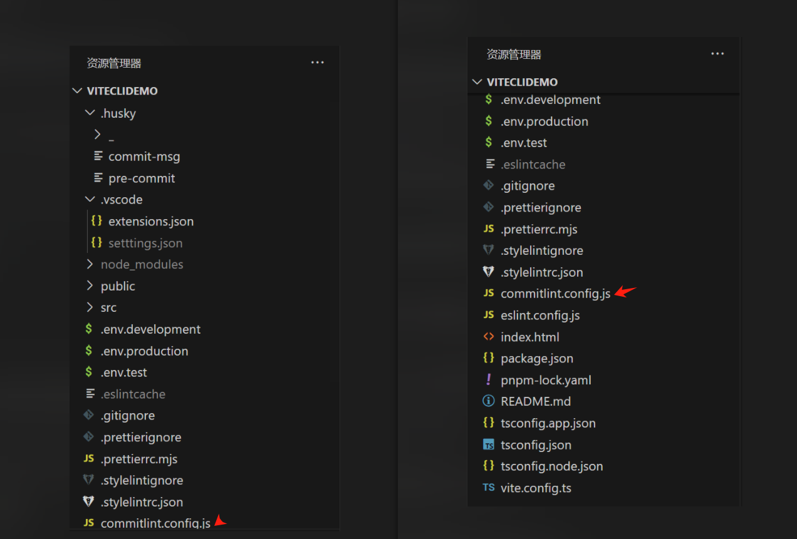
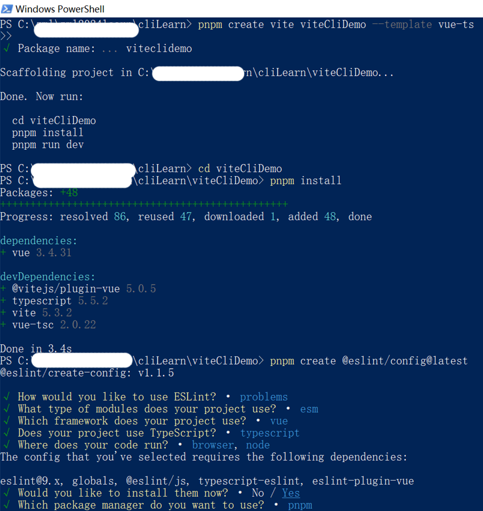
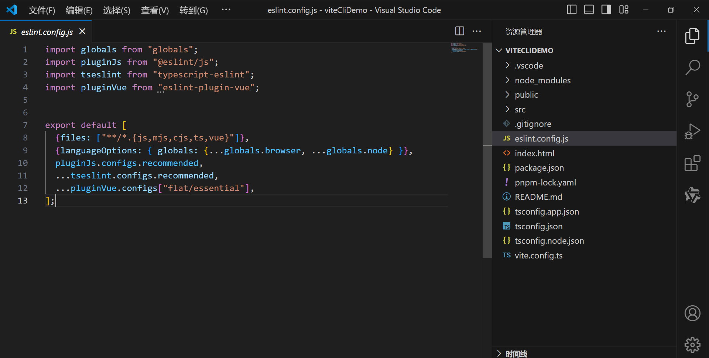

# Vue3+Vite+TS: 配置 ESLint、Prettier、Stylelint、Husky、Lint-staged、Commitlint 实现代码和提交规范

建议使用 pnpm 安装,npm 慢,yarn 本人电脑配置 eslint 包出错

项目完整目录结构



## 一、一个 Vite 项目

[vite 项目创建](https://cn.vitejs.dev/guide/)

```sh
pnpm create vite viteCliDemo --template vue-ts
```

## 二、ESLint 安装与配置

[eslint](https://eslint.nodejs.cn/)

1. 安装

```sh
pnpm create @eslint/config@latest
```



项目下会自动生成 eslint 的配置文件



2. 配置 eslint.config.js 忽略语法检测的文件

[ignoring-files](https://eslint.org/docs/latest/use/configure/migration-guide#ignoring-files)

```js
export default [
  //  其他配置
  {
    ignores: [
      "config/*",
      ".husky",
      ".local",
      "public/*",
      ".vscode",
      "node_modules",
    ],
  },
];
```

3. 提前安装：vscode 安装 ESLint 插件

4. packaje.json 添加脚本

```json
"scripts": {
  "lint:eslint": "eslint --cache --max-warnings 0 \"src/\*_/_.{js,vue,ts}\" --fix"
}
```

然后运行，来进行 eslint 语法检测

```sh
pnpm run lint:eslint
```

5. 问题： Parsing error: Unexpected token )eslint

[解决:参考链接]https://github.com/eslint/eslint/discussions/17221

解决方案如下：

```js
export default [
  //  ...
  {
    languageOptions: {
      //  ...
      parserOptions: {
        ecmaVersion: "latest",
        parser: "@typescript-eslint/parser",
        sourceType: "module",
      },
    },
  },
];
```

6. 验证：

此时，比如在 .vue 文件中添加一个变量，但没有使用，运行 pnpm run lint:eslint 命令 则会提示语法错误。则证明 eslint 的配置生效了。

则会提示如下错误：

---

39:7 error 'a' is defined but never used @typescript-eslint/no-unused-vars

✖ 1 problem (1 error, 0 warnings)

ELIFECYCLE  Command failed with exit code 1.

---

5. \* 配置 vite-plugin-eslint

```sh
pnpm add vite-plugin-eslint -D
```

在 vite.config.ts 中添加如下配置：

问题：...from "vite-plugin-eslint" 可能会报红线

解决方案：添加 @ts-expect-error

```js
import { defineConfig } from "vite";
import vue from "@vitejs/plugin-vue";
// @ts-expect-error vite-plugin-eslint is not typed
import vitePluginESLint from "vite-plugin-eslint";

// https://vitejs.dev/config/
export default defineConfig({
  plugins: [vue(), vitePluginESLint({ fix: true })],
});
```

## 三、Prettier 安装与配置

[prettier](https://www.prettier.cn/)

1. 安装

```sh
pnpm add --save-dev --save-exact prettier
```

[--save-exact 参数](https://pnpm.io/zh/cli/add#--save-exact--e)

--save-exact, -E

保存的依赖会被指定为一个确切的版本, 而不是使用 pnpm 的默认 semver range operator 配置.

2. 配置

在根目录下创建一个空的 .prettierrc.mjs 配置文件

```js
export default {
  printWidth: 80, // 一行最多80个字符
  tabWidth: 2, // 设置工具每一个水平缩进的空格数
  useTabs: false, //不使用缩进,而使用空格
  semi: true, // 句末是否加分号
  vueIndentScriptAndStyle: true, //Vue文件中＜script＞和＜style＞是否缩进
  singleQuote: false, // 用单引号
  trailingComma: "none", // 最后一个对象元素符加逗号
  bracketSpacing: true, // 箭头函数,只有一个参数的时候,也需要括号
  arrowParens: "always", // 不需要写文件开头的 @prettier
  insertPragma: false, // 不需要自动在文件开头加入 @prettier
  endOfLine: "auto", // 换行符使用 auto 有些地方说的是推荐使用lf
};
```

3. 添加.prettierignore 忽略文件

在根目录下创建一个空的 .prettierignore 配置文件

```sh
# Ignore artifacts:
build
coverage

# Ignore all HTML files:
**/*.html

dist
.local
.output.js
node_modules

**/*.svg
**/*.sh

public
.npmrc
```

4. vscode 安装 Prettier - Code formatter 插件

5. packaje.json 添加脚本

```json
"scripts":{
  "format": "prettier --config .prettierrc.mjs \"src/**/*.{js,vue,ts}\" --write"
}
```

然后运行，按照配置文件 .prettierrc.mjs 来进行代码格式检测

```sh
pnpm run format
```

6. 验证：

比如设置

semi: false, // 句末是否加分号

singleQuote: true, // 用单引号

则 .vue 文件不会在句尾添加分号，.vue 文件 均会采用单引号

## 四、Stylelint 安装与配置

[stylelint](https://stylelint.io/)

1. 安装 stylelint 相关插件

```sh
pnpm add stylelint stylelint-config-standard-scss -D

pnpm add postcss postcss-html stylelint-config-recommended-vue -D

pnpm add vite-plugin-stylelint -D
```

2. 配置

在根目录下创建一个空的 .stylelintrc.json 配置文件

```json
{
  "extends": [
    "stylelint-config-standard-scss",
    "stylelint-config-recommended-vue/scss"
  ]
}
```

2.2 补充配置

vite.config.ts 中添加如下配置：

```js
// ...
import styleLintPlugin from "vite-plugin-stylelint";

// https://vitejs.dev/config/
export default defineConfig({
  plugins: [
    vue(),
    //  ...
    styleLintPlugin({
      fix: true,
      include: ["src/**/*.{css,scss,sass,vue}", "src/*.{css,scss,sass,vue}"],
    }),
  ],
});
```

3. 添加忽略文件.stylelintignore

```sh
dist
public
node_modules
```

4. 配置自动格式化

.vscode/setttings.json 保证拉取到本地的代码，和以后的编码风格始终保持一致

```json
{
  "editor.formatOnSave": true,
  "editor.codeActionsOnSave": {
    "source.fixAll.eslint": true,
    "source.fixAll.stylelint": true
  },
  "stylelint.validate": ["vue", "css", "scss"],
  "editor.defaultFormatter": "esbenp.prettier-vscode",
  "[vue]": {
    "editor.defaultFormatter": "esbenp.prettier-vscode"
  },
  "[ts]": {
    "editor.defaultFormatter": "esbenp.prettier-vscode"
  },
  "[scss]": {
    "editor.defaultFormatter": "esbenp.prettier-vscode"
  },
  "typescript.tsdk": "node_modules/typescript/lib"
}
```

5. 在 package.json 中添加 Stylelint 脚本

在你的 package.json 文件中添加一个脚本来运行 Stylelint：

```json
"scripts":{
  "lint:css": "stylelint \*_/_.{css,scss,vue} --fix"
}
```

## 五、husky 安装

1. 安装

```sh
pnpm add husky lint-staged -D
```

2. 初始化 git init 确保 git 管理项目

```sh
pnpm exec husky init
```

pnpm exec
在项目范围内执行 shell 命令。

执行完该命令后,它在.husky/中创建一个预提交脚本

在 package.json 中运行 prepare 脚本。

```sh
pnpm run prepare
```

手动创建 pre-commit 文件

```sh
#!/usr/bin/env sh
. "$(dirname -- "$0")/_/husky.sh"
npx lint-staged
```

package.json 添加脚本

```json
{
  "lint-staged": {
    "*.{js,jsx,vue,ts,tsx}": ["npm run lint:eslint", "npm run format"],
    "*.{css,scss,vue}": ["npm run lint:css"]
  }
}
```

## 六、Commitlint 安装与配置

[commitlint](https://commitlint.js.org/)

1. 安装

```sh
pnpm add @commitlint/config-conventional @commitlint/cli -D
```

2. 配置

在项目根目录下创建 commitlint.config.js 文件

```js
export default {
  extends: ["@commitlint/config-conventional"],
  rules: {
    "type-enum": [
      2,
      "always",
      [
        "build", // 编译相关的修改，例如发布版本，对项目构建或者依赖的改动
        "feat", // 新功能（feature）
        "fix", // 修复bug
        "docs", // 文档（documentation）修改
        "upd", // 更新某功能
        "style", // 代码格式修改, 注意不是 css 修改（不影响代码运行的变动）
        "refactor", // 代码重构
        "perf", // 性能优化,比如提升性能、体验
        "test", // 测试，测试用例修改
        "chore", // 其他修改, 比如改变构建流程、或者增加依赖库、工具等
        "revert", // 撤销commit，回滚上一个版本
      ],
    ],
    "type-case": [0],
    "type-empty": [0],
    "scope-empty": [0],
    "scope-case": [0],
    "subject-full-stop": [0, "never"],
    "subject-case": [0, "never"],
    "header-max-length": [0, "always", 72],
  },
};
```

3. 添加提交信息校验钩子

创建.husky/commit-msg 文件用于 git 提交信息校验

```sh
#!/usr/bin/env sh
. "$(dirname -- "$0")/_/husky.sh"
npx --no -- commitlint --edit $1
```

4. commit 验证

注意：提交格式是关键字:一个空格+描述

```sh
git add .
git commit -m "feat: 添加 commitlint 配置"
```

## 七、vue 下的模式设置

1. 环境

开发环境 测试环境 dev

测试同学使用的是 预发环境 prev

生产环境 pro

2. 含义

.env.development 开发环境

.env.test 预发环境

.env.production 生产环境

3. 在根目录手动增加文件

.env.development

```sh
# 开发的时候 axios 的请求地址不一样
VITE_BASE_URL = 'http://dev.jd.com/api'
```

.env.test

```sh
VITE_BASE_URL = 'http://yewu-pre.jd.com/api'
```

.env.production

```sh
VITE_BASE_URL = 'https://pre.jd.com/api'
```

查看当先环境变量的值

```js
console.log(import.meta.env.VITE_BASE_URL);
```

---

结束

---

参考链接：

- [Vue3+Vite+TS: 配置 ESLint...](https://zhuanlan.zhihu.com/p/700412551)

- [vue3 企业级项目骨架搭建，涉及 vite、eslint、prettierrc、husky、commitlint、lint-staged、stylelint](https://www.bilibili.com/video/BV1BV4y1N7pd?p=1&vd_source=097a85eda4f684cca08f50ad350530e1)
