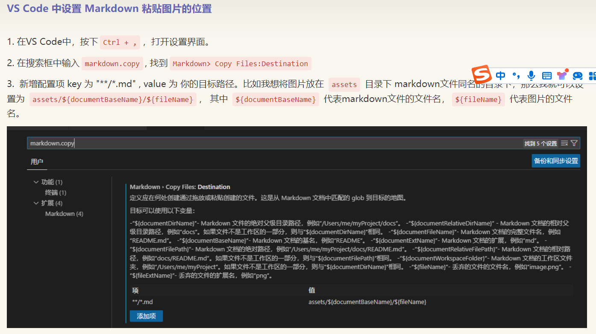
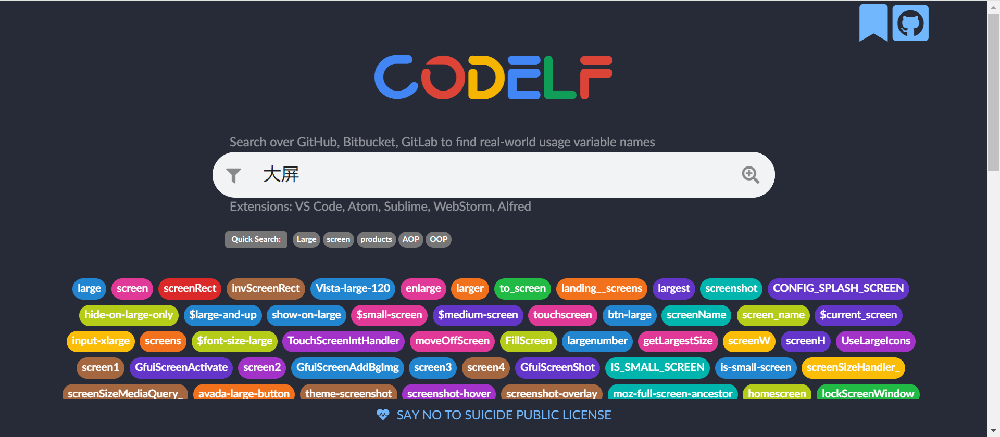
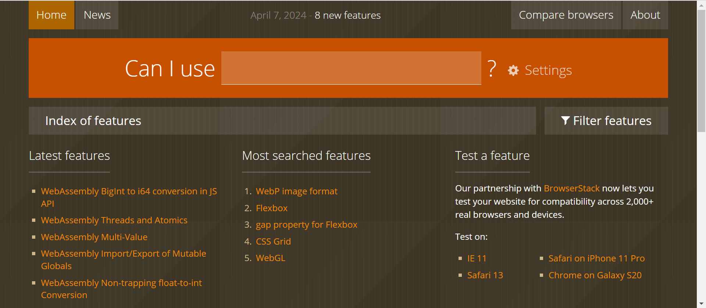
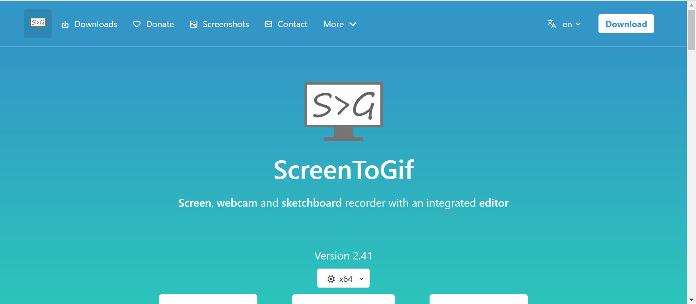
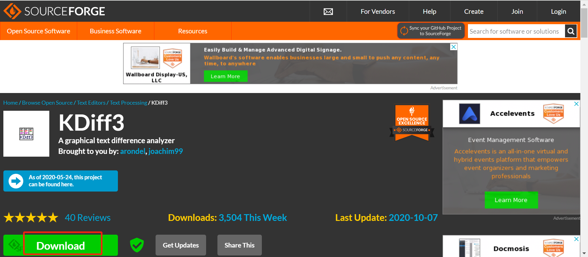
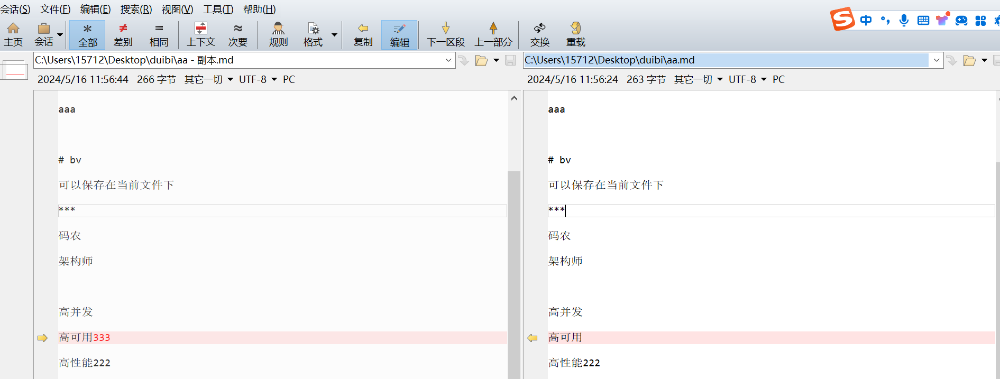
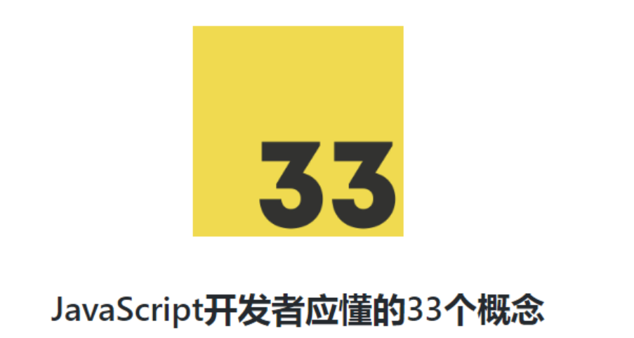

# 工具，网站，插件

## vscode 插件

- :emojisense: | Matt Bierner
- 别名路径跳转 | lihuiwang
- any-type | 铁皮饭盒
- Auto Close Tag | Jun Han
- Auto Rename Tag | Jun Han
- Chinese (Simplified) (简体中文) | Microsoft
- Element Plus Snippets | 一只大老虎
- ESLint | Microsoft
- Git Graph | mhutchie
- GitLens | GitKraken
- Highlight Matching Tag | vincaslt
- IntelliSense for CSS class names in | Zignd
- JavaScript (ES6) code snippets | charalampos karypidis
- json | ZainChen
- JSON to TS | MariusAlchimavicius
- Live Server | Ritwick Dey
- markdown-formatter | mervin
- open in browser | TechER
- Path Autocomplete | Mihai Vilcu
- Path Intellisense | Christian Kohler
- Prettier - Code formatter | Prettier
- TONGYI Lingma | Alibaba-Cloud
- Vue - Official | Vue
- Vue 3 Snippets | hollowtree
- Vue VSCode Snippets | sarah.drasner

### VS Code 中设置 Markdown 粘贴图片的位置



## 工具类

### 1. codelf--命名神器

还在为命名到词穷而苦恼吗，codeif 解决你的命名问题，筛选统计出 GitHub 命名出现频率，给你更好的命名体验，非软件，点我体验 [codeif](https://unbug.github.io/codelf/)



### 2. can i use

想知道某个属性，API 方法兼容性怎么样，can i use 能给你比较权威的浏览器兼容情况预览图，对部分项目有特殊浏览器版本兼容时，这个网站能帮你了解某些方式是否可用。点我跳转 [can i use](https://caniuse.com/)



### 3. screentogif

一款能帮助你录屏，带编辑，记录屏幕点击等等功能的 GIF 制作神器，支持帧数编辑，功能强大，录制的 GIF 画质贼高，像我的博客插的动图全是靠这个软件录制的。[点我去官网](https://www.screentogif.com/?l=zh_cn)



### 4. kdiff3 文件比较合并工具

有时候在我们大脑没印象的情况下，一个文件不知道改了哪，然后功能疯狂报错，那么 kdiff3 就是一款能帮你对比文件细微修改的工具,[官网](https://sourceforge.net/projects/kdiff3/)





## 阅读

JavaScript 开发者应懂的 33 个概念[点我跳转阅读](https://github.com/stephentian/33-js-concepts?utm_source=gold_browser_extension)



## 壁纸网站

[pixabay](https://pixabay.com/zh/)

[wallhaven](https://wallhaven.cc/)

[bing-wallpaper](https://github.com/niumoo/bing-wallpaper)

PS：文章中如果网站打不开，那就得考虑别的上网方式了，方法自寻。

## 常用网站

[react](https://react.dev/learn)

[vuejs](https://cn.vuejs.org/guide/introduction.html)

[Vite](https://cn.vitejs.dev/guide/)

[reset-css](https://www.npmjs.com/package/reset-css)

```sh
npm i reset-css
```

[pinia](https://pinia.vuejs.org/zh/core-concepts/)

```sh
yarn add pinia
```

[Vue-Router](https://router.vuejs.org/zh/guide/)

[element-plus](https://element-plus.org/zh-CN/)

[docsify](https://docsify.tb1043.com/#/?id=docsify)

[npm](https://www.npmjs.com/)

[vuex](https://vuex.vuejs.org/zh/)

[wangeditor](https://www.wangeditor.com/v5/getting-started.html)

[qwerty](https://qwerty.kaiyi.cool/)

[vue-grid-layout-v3](https://merfais.github.io/vue-grid-layout-v3/zh/)

[软件管家-软件目录](http://lspcy.cn/index.php/%E8%BD%AF%E4%BB%B6%E7%9B%AE%E5%BD%95/)

[vant-ui](https://vant-ui.github.io/vant/#/zh-CN)

[mockjs](http://mockjs.com/)

[mail.163.com](https://mail.163.com/js6/main.jsp?sid=gMpZjLllsguitugELdllhmhnEmufdRgl&df=mail163_letter#module=welcome.WelcomeModule%7C%7B%7D)

[hBuilderX](https://www.dcloud.io/)

[AI 启明星](https://chat.aistar.com/Dialogue)

[线上 WPS](https://www.kdocs.cn/latest)

[51 自学网](https://www.51zxw.net/newan/WebSearch/Course)

[CSS Grid 网格布局教程](http://www.ruanyifeng.com/blog/2019/03/grid-layout-tutorial.html?spm=a2c6h.13046898.publish-article.22.6f6c6ffaBJ83z8)

[element-plus-playground](https://element-plus.run/#eyJzcmMvQXBwLnZ1ZSI6IjxzY3JpcHQgc2V0dXAgbGFuZz1cInRzXCI+XG5pbXBvcnQgeyByZWYsIHZlcnNpb24gYXMgdnVlVmVyc2lvbiB9IGZyb20gJ3Z1ZSdcbmltcG9ydCB7IHZlcnNpb24gYXMgZXBWZXJzaW9uIH0gZnJvbSAnZWxlbWVudC1wbHVzJ1xuaW1wb3J0IHsgRWxlbWVudFBsdXMgfSBmcm9tICdAZWxlbWVudC1wbHVzL2ljb25zLXZ1ZSdcblxuY29uc3QgbXNnID0gcmVmKCdIZWxsbyBXb3JsZCEnKVxuPC9zY3JpcHQ+XG5cbjx0ZW1wbGF0ZT5cbiAgPGgxPnt7IG1zZyB9fTwvaDE+XG4gIDxlbC1pbnB1dCB2LW1vZGVsPVwibXNnXCIgLz5cblxuICA8cD5cbiAgICA8ZWwtaWNvbiBjb2xvcj1cInZhcigtLWVsLWNvbG9yLXByaW1hcnkpXCI+PEVsZW1lbnRQbHVzIC8+PC9lbC1pY29uPlxuICAgIEVsZW1lbnQgUGx1cyB7eyBlcFZlcnNpb24gfX0gKyBWdWUge3sgdnVlVmVyc2lvbiB9fVxuICA8L3A+XG48L3RlbXBsYXRlPlxuIiwiaW1wb3J0LW1hcC5qc29uIjoie1xuICBcImltcG9ydHNcIjoge31cbn0iLCJ0c2NvbmZpZy5qc29uIjoie1xuICBcImNvbXBpbGVyT3B0aW9uc1wiOiB7XG4gICAgXCJ0YXJnZXRcIjogXCJFU05leHRcIixcbiAgICBcImpzeFwiOiBcInByZXNlcnZlXCIsXG4gICAgXCJtb2R1bGVcIjogXCJFU05leHRcIixcbiAgICBcIm1vZHVsZVJlc29sdXRpb25cIjogXCJCdW5kbGVyXCIsXG4gICAgXCJ0eXBlc1wiOiBbXCJlbGVtZW50LXBsdXMvZ2xvYmFsLmQudHNcIl0sXG4gICAgXCJhbGxvd0ltcG9ydGluZ1RzRXh0ZW5zaW9uc1wiOiB0cnVlLFxuICAgIFwiYWxsb3dKc1wiOiB0cnVlLFxuICAgIFwiY2hlY2tKc1wiOiB0cnVlXG4gIH0sXG4gIFwidnVlQ29tcGlsZXJPcHRpb25zXCI6IHtcbiAgICBcInRhcmdldFwiOiAzLjNcbiAgfVxufVxuIiwiX28iOnt9fQ==)

[MD5 在线](https://www.sojson.com/encrypt_md5.html)

[图片压缩](https://tinypng.com/)
